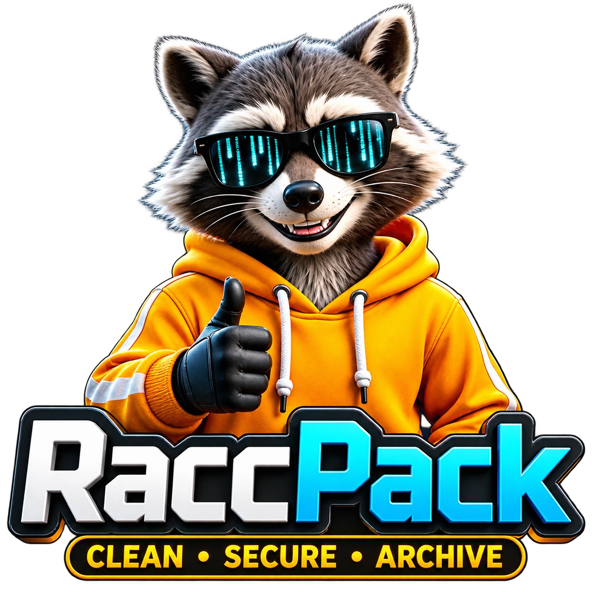

# raccpack

<p align="center">
  
</p>

<p align="center">
  <a href="https://www.rust-lang.org"></a>
  <a href="https://doc.rust-lang.org/cargo/"></a>
  <a href="Cargo.toml"></a>
  <a href="https://github.com/y-tretyakov/raccpack/actions/workflows/wiki.yml"></a>
  <a href="https://github.com/y-tretyakov/raccpack"></a>
  <a href="https://tauri.app"></a>
  <a href="https://clap.rs"></a>
  <a href="https://ratatui.rs"></a>
  <a href="https://github.com/FiloSottile/age"></a>
  <a href="LICENSE-MIT"></a>
</p>

CLI / TUI / Desktop tool for scanning project trees, finding secrets, cleaning build trash, and packing each project into a **den** — a store of age-encrypted secret archives and `tar.zst` project packs.

**User documentation:** [https://y-tretyakov.github.io/raccpack/](https://y-tretyakov.github.io/raccpack/)

## Status

**Version `0.2.13`** — MVP `0.1.0` closed; **Alpha** (stash / rinse / raid) done, `A4` git+DX in progress toward `0.3.0`.

| Command | Status | Role |
|---------|--------|------|
| **sniff** | Available | Discover projects by markers, stack, sizes, versioned cache |
| **dig** | Available | Secret scan (filename + content), masked values, risk levels, exit policy, git status per finding |
| **pack** | Available | `tar.zst` into den (`packs/…`), name/content deny, DryRun default / `--yes` |
| **stash** | Available (Alpha) | Age-encrypted secret archives into den (`secrets/…`), optional source removal |
| **rinse** | Available (Alpha) | Build-trash cleanup by strategies (`rust`/`node`/`python` default, more opt-in), DryRun default / `--yes` |
| **raid** | Available (Alpha) | Orchestrated stash → rinse → pack → move in one command; atomic default (staging + WAL + rollback), manifest JSON in den, `--fail-fast` mode, exit 1 on `!success` |
| **init** | Available (Alpha) | Create default config (`config_version = 1`) with prefilled paths; optional den skeleton (`--ensure-den`), `--force` to overwrite |
| **TUI / Desktop** | Planned (Beta) | Ratatui / Tauri + React |

Details and exact flags: [wiki · CLI](https://y-tretyakov.github.io/raccpack/cli-usage.html).

## Quick start

```bash
git clone https://github.com/y-tretyakov/raccpack.git
cd raccpack
cargo build --release
# optional: install -m 0755 target/release/racc ~/.local/bin/racc

mkdir -p ~/.config/raccpack
cat > ~/.config/raccpack/config.toml <<'EOF'
[paths]
scan_root = "~/DEV/PROJS"
den_dir = "~/.raccpack/den"
EOF

racc sniff
racc dig --project ~/DEV/PROJS/my-app
racc pack --project ~/DEV/PROJS/my-app          # dry-run
racc pack --project ~/DEV/PROJS/my-app --yes    # write pack to den

# stash (Alpha): passphrase via env or interactive prompt
export RACCPACK_PASSPHRASE='your-strong-passphrase'
racc stash --project ~/DEV/PROJS/my-app --yes

# rinse (Alpha): clean build-trash dirs by strategies (defaults: rust, node, python)
racc rinse --project ~/DEV/PROJS/my-app          # dry-run
racc rinse --project ~/DEV/PROJS/my-app --yes    # actually remove
```

JSON output: add `--json` to any command.

## What is supported

Exact tables live in the wiki: **[Что поддерживается](https://y-tretyakov.github.io/raccpack/supported.html)**.

Summary:

- **Project markers (14):** `Cargo.toml`, `package.json`, `go.mod`, `pyproject.toml`, `setup.py`, `requirements.txt`, `pom.xml`, `build.gradle`, `build.gradle.kts`, `Gemfile`, `composer.json`, `CMakeLists.txt`, `Makefile`, `.git`
- **Framework hints (root files only):** Next.js, Nuxt, Angular, Vite, Deno; Django; Scala/sbt; Rails
- **Secret filename patterns (28):** `.env` family, SSH/private keys, keystores, credentials, registry configs, `secrets.*`, service-account JSON, etc.
- **Content markers (12):** AWS, GitHub tokens, Slack, Stripe, PEM headers, connection strings, JWT-like, generic `api_key` / `secret` assignments
- **Skip dirs (18):** `node_modules`, `target`, `dist`, `build`, VCS, Python caches/venvs, IDE, `.raccpack`, `*.egg-info`, …
- **Cleanup strategies (6):** `rust`, `node`, `python` (enabled by default) plus opt-in `jvm`, `go`, `generic` for `rinse`

## Workspace

```
raccpack/
  Cargo.toml                 # workspace (resolver 2)
  crates/
    raccpack-core/           # library: domain + use-cases (no UI deps)
    raccpack-cli/            # binary `racc`
  wiki/                      # VitePress user docs (RU-first)
  docs/                      # development specs (not published)
  LICENSE-MIT
  LICENSE-APACHE
```

Dual-licensed **MIT OR Apache-2.0**. `Cargo.lock` is committed for reproducible builds. MSRV **1.75**.

## Build & test

```bash
cargo build
cargo test
cargo test -p raccpack-core
cargo fmt --check
cargo clippy -p raccpack-core --all-targets -- -D warnings
```

## Documentation

**User wiki** (`wiki/`, VitePress) → [GitHub Pages](https://y-tretyakov.github.io/raccpack/):

```bash
pnpm install
pnpm run wiki:dev
pnpm run wiki:build
pnpm run wiki:preview
```

Primary locale is Russian; English skeleton under `wiki/en/`.

**Development docs** under `docs/` (roadmap, architecture, stage specs) are not part of the published wiki.

## Den layout

```text
{den}/
├── .den-version
├── README.txt
├── packs/{yyyy}/{mm}/{slug}__{utc_timestamp}.tar.zst
├── secrets/{yyyy}/{mm}/{slug}__{utc_timestamp}__secrets.age
├── manifests/{yyyy}/{mm}/…
└── staging/                 # temporary; safe to clean
```

Do not commit a den to git. Keep passphrases offline.

## Git workflow

| Branch | Role |
|--------|------|
| `main` | Milestone releases only (protected) |
| `dev` | Main integration branch |
| stage branches | Short-lived from `dev` (e.g. `a2-rinse`, `a3-raid`) |

1. Work on stage branches created from `dev`.
2. Open PR **into `dev`**; squash merge; delete the stage branch.
3. Merge `dev` → `main` + tag + GitHub Release **only** on milestones:
   - MVP `v0.1.0` · Alpha `v0.3.0` · Beta `v0.5.0` · RC `v0.9.0` · Stable `v1.0.0`
4. Hotfixes after a release: branch from `main` (or tag) → PR to `main` → backport to `dev`.

Branch protection: squash-only; `main` requires PR + 1 approval; no force push / no deletions on `main` and `dev` (maintainers may bypass).

## Roadmap (high level)

```text
MVP     sniff → dig → pack + den                ✅ 0.1.0
Alpha   stash ✅ → rinse ✅ → raid ✅ → git+CI  → 0.3.0
Detect v2  composite DAG for monorepos         → 0.4.x
Beta    TUI → Desktop (Tauri) → security harden → 0.5.0
RC      API/den freeze → quality → UX         → 0.9.x
Stable  1.0.0
```

User-facing roadmap: [wiki](https://y-tretyakov.github.io/raccpack/roadmap.html).

## License

Licensed under either of:

- Apache License, Version 2.0 ([LICENSE-APACHE](LICENSE-APACHE))
- MIT license ([LICENSE-MIT](LICENSE-MIT))

at your option.
